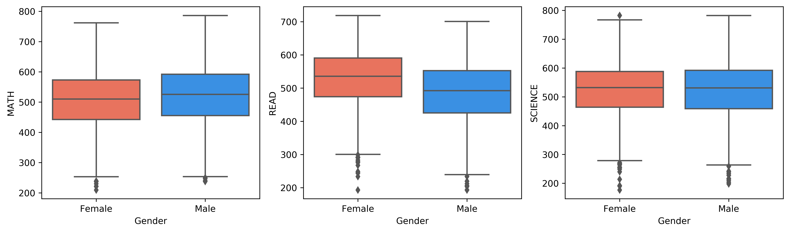
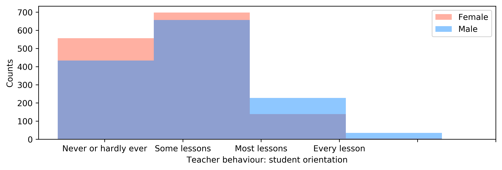

# Explore PISA-2012 Results
## by Viktor Begun

## Dataset

In this project the data from [PISA-2012](http://www.oecd.org/pisa/keyfindings/pisa-2012-results.htm) test provided by [Udacity](https://www.udacity.com/) are analyzed. 

[According to wikipedia:](https://en.wikipedia.org/wiki/Programme_for_International_Student_Assessment) "The Programme for International Student Assessment (PISA) is a worldwide study by the Organisation for Economic Co-operation and Development (OECD) in member and non-member nations intended to evaluate educational systems by measuring 15-year-old school pupils' scholastic performance on mathematics, science, and reading."

## Summary of Findings

> Summarize all of your findings from your exploration here, whether you plan on bringing them into your explanatory presentation or not.

- There is a difference between the scores for different genders on average, however the individual differences within a gender are larger.

- The scores are gender neutral for the `SCIENCE` indicator. Girls have better scores in `READ`, while boys have slightly better scores in `MATH`. However, the difference is less than the variance. Therefore, one can say that there is a difference between the scores for different genders on average, however the individual differences within a gender are larger.

- The `READ` and `SCIENCE` distributions for males and the `SCIENCE` for femails seem to have two peaks, while all the distributions have the outliers on the left tail. It may indicate that there are several subgroups in the population 
    - the average (the largest group with Gauss-like distribution), 
    - those who are successful in reading, math and science (smaller group), 
    - those who have difficulties with these subjects (much smaller group).  

- Teachers are rarely student-oriented. 

It may be a consequence of large classes. If there is 20 pupils, while a lesson is 45 minutes, then a teacher can give on average only 2 minutes of attention to every student. This is definitely too small compared to what a person would expect in a usual one-to-one communication. 

- Males feel more attention from teachers than females

#### Good notes in math correlate with:
- the grade in either national or international grading system 
- [socio-economical status of parents and of the family:](https://stats.oecd.org/glossary/detail.asp?ID=5405)
    - highest parental occupational status
        - Father Socio-Economic Index of Occupational Status
        - Mother Socio-Economic Index of Occupational Status
    
- home possessions from a desk to study at to cars and musical instruments
- openness for problem solving
- highest parental education in years

[See Procedures and Construct Validation of Context Questionnaire Data](https://www.oecd.org/pisa/sitedocument/PISA-2015-Technical-Report-Chapter-16-Procedures-and-Construct-Validation-of-Context-Questionnaire-Data.pdf) for the explanation of the abbreviations.

- The strongest correlation of math scores is with the grade. 

The reason can be that students understand math better in higher grades, but also that one can go to a next grade only with good scores in math.

- The second strongest correlation of math scores is with the index of social economical and cultural status. 

- The indicators not directly related to school have correlation coeffitients less than 0.5. 

This indicates that children in Germany have a good access to the education of math independently of all measured factors in the PISA-2012 test.

#### Good notes in math anti-correlate with:
- age at [ISCED level 1](https://en.wikipedia.org/wiki/International_Standard_Classification_of_Education), i.e. age of starting a school.
- average time per week on language
- internet use at school on a typical weekday
- internet use outside of school on a typical weekday
- mathematics anxiety
- teacher behaviour: student orientation

[See Pisa 2012 Technical Report](https://www.oecd.org/pisa/pisaproducts/PISA%202012%20Technical%20Report_ANNEX%20B%20%E2%80%93%20CONTRAST%20CODING%20USED%20IN%20CONDITIONING.pdf) for the explanation of abbreviations.

- It is surprising to find that "student orientation" of a teacher anti-correlates with the grade.

- All negative correlations are weaker than positive correlations. 

This may indicate that there are no special negative factors that may lower the ability of a student to study math.

- The strongest negative correlation with math grades has the Mathematics Anxiety.

- Internet at school is bad for math, but internet at home has no influence on the math scores! 

The reason for the anti-correlation between Internet at school and math scores is unclear. However, the independence of the math scores on the hours spent in the internet at home may indicate that the math program in German schools is comprehensible for most pupils, because it leaves as much time for the Internet as a pupil like to spend.  

- The 'student oriented' attitude of a teacher anti-correlates with the math score. 

The reason is unclear. It can be that pupils weaker in math need and receive more attention. However, it can also be that math teachers with less 'student oriented' behavior give more complicated tasks to solve, the pupils can not avoid it, so they start to rely only on themselves, wnich appears more effective.

#### Interesting and surprising interactions between features

- Index of economic, social and cultural status is correlated with highest parental education. 

It may indicate that well educated people in Germany have better status and income.

- Highest parental occupational status is strongly correlated with Socio-Economic Index of Occupational Status of a parent. The correlation is stronger for a father than for a mother. 

This may indicate a gender imbalance in parents income and occupation status.

- The number of hours spent on language has a correlation with student oriented behaviour of a teacher. A similar small positive correlation has the amount of internet at school and student oriented behaviour of a teacher. However, the number of hours spent on language is unrelated with the number of hours of internet at school.

**Prerequisites and used libraries:** [Python](https://www.udacity.com/) enviroment (e.g. [Anaconda](https://www.anaconda.com)), [Jupyter Notebook](https://jupyter.org/), [Pandas](https://pandas.pydata.org/), 

[matplotlib](https://matplotlib.org/)
[seaborn](https://seaborn.pydata.org)
[SciPy](https://www.scipy.org/)
[statistics](https://docs.python.org/3/library/statistics.html)

  **The file with the project: `Udacity_Project_6_Data_Visualization_Begun.ipynb`**